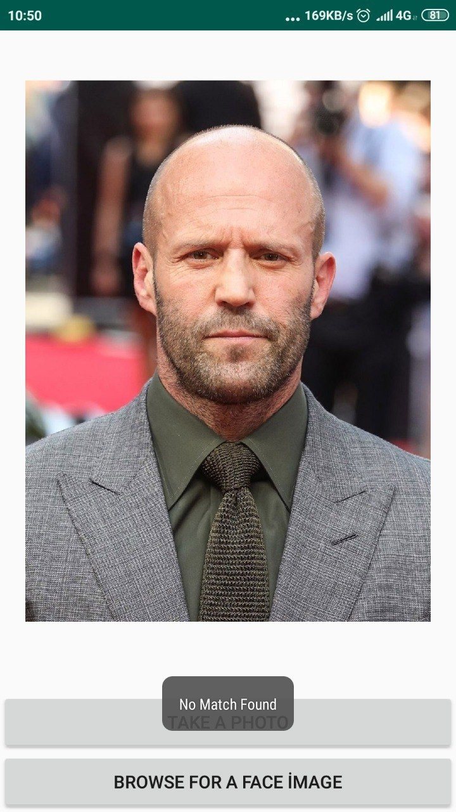

# Phoneroll
Image processing based attendance control system

This is an attendance control system which operates over smartphones. Taking the student attendance without the need of any extra hardware than a basic smarphone is the main goal of this project.

Face and phone ID data are stored alongside the student data to be able to measure and trace the attendances of the students precisely and effectively. This allows us to prevent any misusage that might be caused by the users via lending their phone to others. User authentication is performed by their biometric face data which can’t be changed therefore we can be sure about the fact that students are performing operations for themselves. 

The student also needs to be in the classroom for the attendance to count. That verification is  also performed using the smartphone camera data. User needs to take photograph of the classroom they are currently in. Then we can verify the attendance of the student by comparing the provided classroom photo with the panaromic reference classroom photo.  

#Opencv Android SDK is needed.

